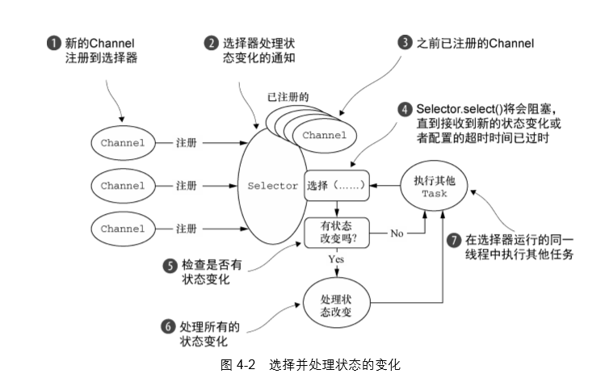

## 传输

### Netty内置传输

- NIO

	

	选择并处理状态的变化

- Epoll

	用于Linux的本地非阻塞传输

----

## ByteBuf

**netty的数据容器**

## ByteBufHolder

我们经常发现，除了实际的数据负载之外，我们还需要存储各种属性值。
HTTP 响应便是一 个很好的例子，除了表示为字节的内容，还包括状态码、cookie 等。 
为了处理这种常见的用例，Netty 提供了ByteBufHolder。

