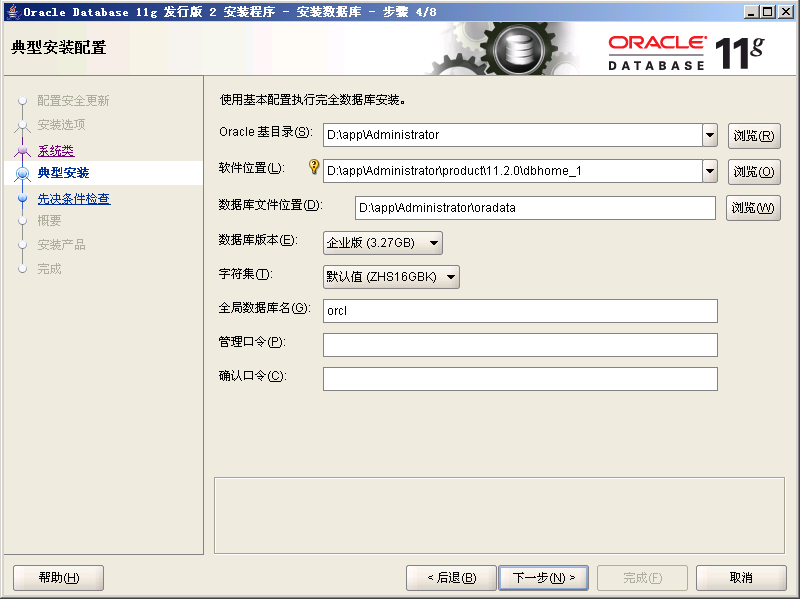
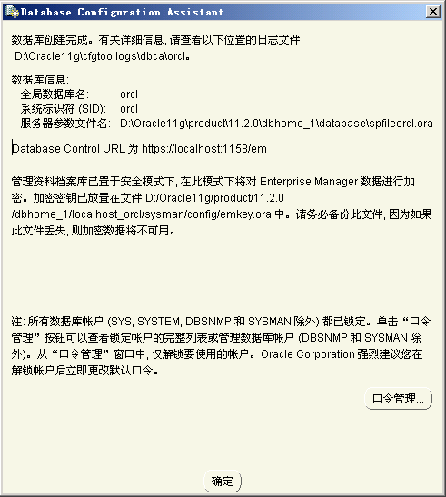
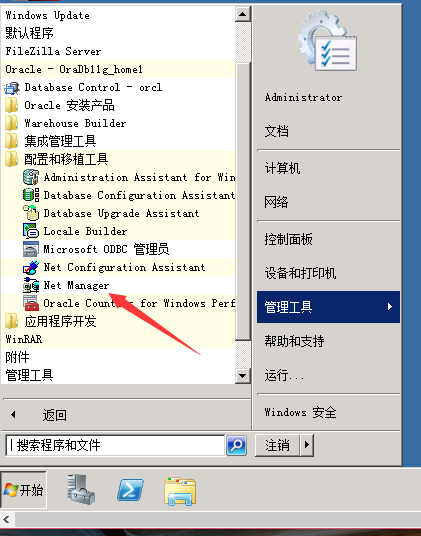
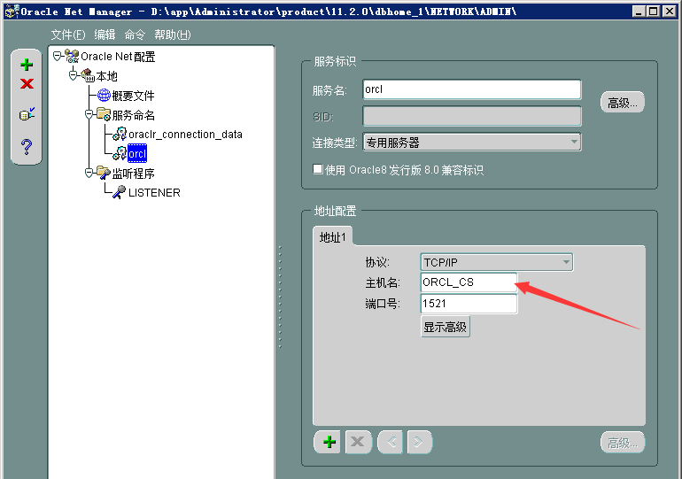
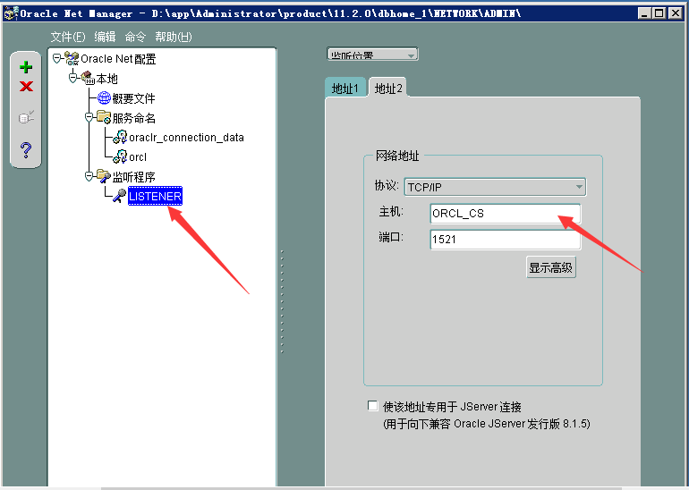
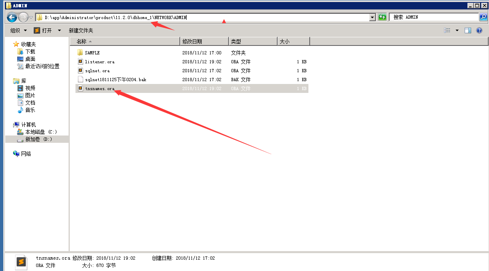

## **Windows server2008 安装Oracle 11g**

1.将安装文件压缩包win64_11gR2_database_1of2.zip与win64_11gR2_database_2of2.zip解压到同一目录下，点击setup.exe开始安装。

2.注意重设管理口令即sys账号的密码，如下图所示，其他选择默认非系统盘就好。

3.数据库安装完成后注意点击“口令管理”，解锁部分系统账号，例如sys,scott。

## **配置Oracle服务**

1.打开net manager,位置如下图所示。

2.将服务命名中的orcl中的主机名更改为当前计算机名称（当前计算机名称可在“此电脑”右键选择“属性”查看并修改），同时将监听程序中的主机名也改为当前计算机名称。

3.如果还是无法使用plsql工具登录，打开Oracle安装目录下tnsnames.ora文件，检查其中的HOST的值是否全部改为了当前计算机名称。

