概述
====

本文意在阐述本人书写编解码插件的过程，以及注意事项，通过阅读本文，达到人人都能够轻松书写编解码插件的目的。本文共分为四个章节，第一章介绍书写本文的意图，编解码概述，以及书写编解码插件所需的前期准备。

编解码概述
----------

书写编解码插件之前首先需要书写Profile文件，定义如下。

Profile文件用于描述一款设备的能力特性。Lot平台通过解析Profile文件，获取该设备支持的服务（通信协议里面的一条完整报文）、属性（报文中的一个字段）、命令（报文中的一个字段）等信息。

Lot平台通过编解码插件，对NB设备上报的数据和下发给NB设备的命令进行格式转换，即将设备上报的16进制格式的报文转换成json，json数据的具体属性名称将由Profile文件来确定。

前期准备
--------

### 知识储备

熟悉javase基础编程，maven项目管理工具基本命令，jackson类库。

### 开发工具

Eclipse，jdk1.8，maven，NB设备通信协议。

编解码结构解析
==============

Profile结构
-----------

Profile文件是一个深度为四级的文件夹如图3‑4所示。

红色方框中为第一级目录，目录名称为当前项目的名称，命名规则为：设备类型-厂商ID-设备型号，例如WellMonitor_Chinastar_CSiTWLM05，对应图3‑4功能结构中的Product模块。

绿色方框中为第二级目录，包含两个文件夹profile和service。profile文件夹下放置一个devicetype-capability.json，被用来描述一款设备的能力特征，包括设备类型、厂商、型号、协议类型以及提供的服务类型。相当于对当前整个Profile项目信息的一个概述。service文件夹下则包含设备具备的服务能力，每个服务具备的属性、命令以及命令的参数，对应图3‑4中Service模块。

蓝色方框中代表三级目录，代表具体的服务，每个服务中又包含了属性和命令，属性用于描述设备上报数据，命令用于下发指令给设备，分别对应图3‑4中的Property模块和Command模块。

此外只有红色与蓝色方框中文件的命名可以改动，其他名称固定不变。

例如图2‑1service中包含了WellWaterCommand代表井盖+水位设备所有的下行命令；WellWaterDeviceInfo代表该设备上报的设备信息；WellWaterTiming代表该设备定时上报的信息，共计三个服务。关于如何根据设备的通信协议划分服务，将在第三章中详细介绍。

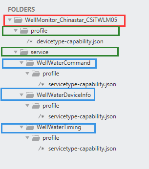

图2‑1 Profile文件结构

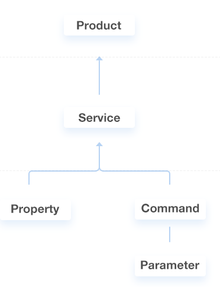

图2‑2 Profile功能结构

编解码插件结构
--------------

编解码插件使用java开发且jdk版本必须为1.8，maven进行项目管理，建议使用eclipse开发工具。其工程目录结构如图3‑4所示。工程的命名建议和Profile项目相同，即采用：设备类型-厂商ID-设备型号的格式。其余包名类名无需更改，即使用华为提供的名称。

其中下行数据编码表示该类将平台下发的json格式的命令转化为字节数组。

上行数据解码则表示该类将设备上报的字节数组转化为json格式数据。

主类则负责调用下行数据编码或者上行数据解码。

工具类中包含了不同数据类型之间转换的方法。

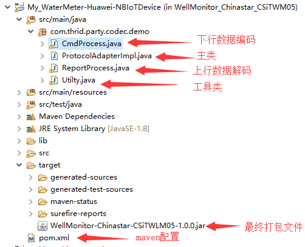

图2‑3 编解码插件工程结构

编解码插件开发
==============

Profile开发
-----------

### 新建工程

新建名称为：设备类型-厂商ID-设备型号的文件夹，例如WellMonitor_Chinastar_CSiTWLM05，打开该文件夹新建profile和service两个子文件夹，如图3‑4所示。**注意profile和service这两个文件夹名称是固定不变的。**

图3‑1 Profile文件夹

### 创建概述文件

打开profile文件夹新建devicetype-capability.json文件，编辑该json文件如图3‑4所示。其中每个字段所代表的含义如图3‑4所示。serviceTypeCapabilities
Json数组包含了该Profile文件所有的服务模块，即每增加一个service都需要在这个数组中添加一个对应的json对象。例如Chinstar公司采用CoAP协议，设备型号为CSiTWLM05的井盖设备包含三个服务（功能）模块，井盖命令、井盖开机信息，井盖定时上报信息。

### Service划分

关于一个设备service的划分，可以采用根据设备通信协议中上报报文的功能码进行划分的方法，即协议中一条上报报文对应一个service（通常一条报文占用一个功能码）。

Service划分步骤：

1.  将通信协议中的报文区分为上行数据和下行数据两类。

2.  将下行数据（命令）写在一个service里面。

3.  将上行数据根据功能码的不同，分成若干个不同的service。

图3‑2 Profile概述文件

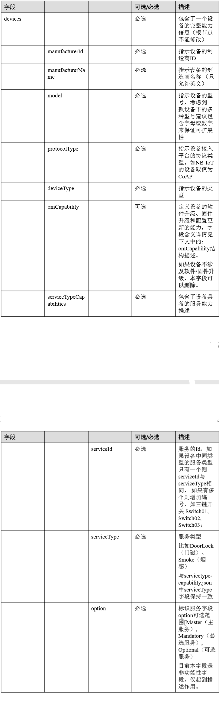

图3‑3 Profile文件字段含义

### 创建service

打开第二级目录的service文件夹，根据步骤二devicetype-capability.json文件中serviceTypeCapabilities数组中定义的service创建对应的文件夹，文件夹名称为serviceId对应的值。每个文件夹下分别创建profile文件夹，profile文件夹下创建servicetype-capability.json文件，用来描述具体服务的功能，如图3‑4所示。

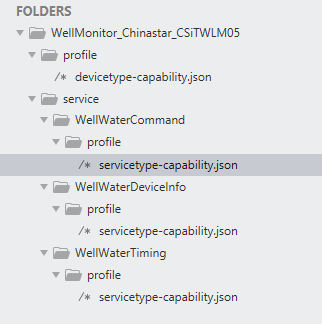

图3‑4 service文件结构

接下来编写每个service对应的servicetype-capability.json，如图3‑4所示的Profile，将井盖水位设备的所有命令下发模块单独写在了一个service中，即WellWaterCommand模块；将设备的上报数据信息按照通信协议中每个报文的功能码区分为不同的service，即WellWaterDeviceInfo（开机信息）模块与WellWaterTiming（定时上报）模块。

### 编写下行service

下行命令在service中的书写格式如图3‑5所示。Commands数组里面存放若干个命令对象，每个命令对象包含CommandName命令的名称和paras命令携带的参数数组，以及responses命令回应数组。paras数组里面包含若干个参数对象。参数对象包含paraName等一系列属性。这每一个参数对象都对应通信协议报文中的一个属性。serviceType的值一定要与当前服务文件夹名称保持一致。

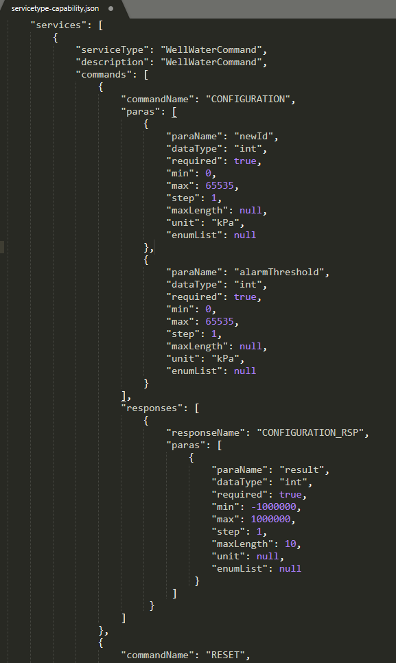

图3‑5 命令service

### 编写上行service

上行属性service比命令service要简单，properties数组中存放的是设备上报上来的数据，每一个json对象对应通信协议报文中的一个属性。propertyName的值可以随意定义，dataType的值如不能根据通信协议中的默认参数值明显的判断该属性的数据类型，应找相关人员确认，否则解析将会出现数据错误。

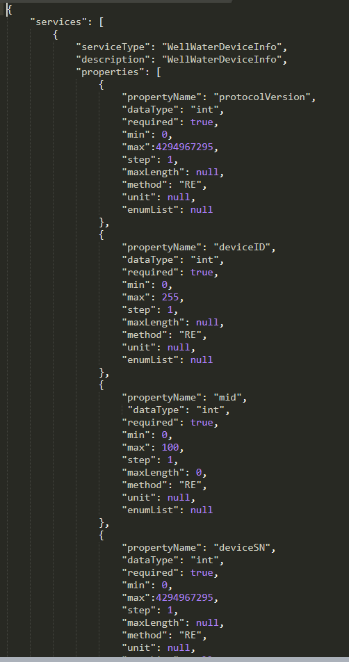

打包Profile
-----------

将WellMonitor_Chinastar_CSiTWLM05文件夹下的profile和service文件打包为zip格式，命名为WellMonitor_Chinastar_CSiTWLM05，并且压缩包内不能包含WellMonitor_Chinastar_CSiTWLM05文件夹这一层目录。

编解码开发
----------

使用eclipse配置本地maven仓库，并导入华为提供的demo工程。

修改pom.xml中的\<artifactId\>XXX\</artifactId\>和\<Bundle-SymbolicName\>XXX\</Bundle-SymbolicName\>命名规范：设备类型-厂商ID-设备型号，与Profile文件保持一致。如图3‑6、图3‑7所示。

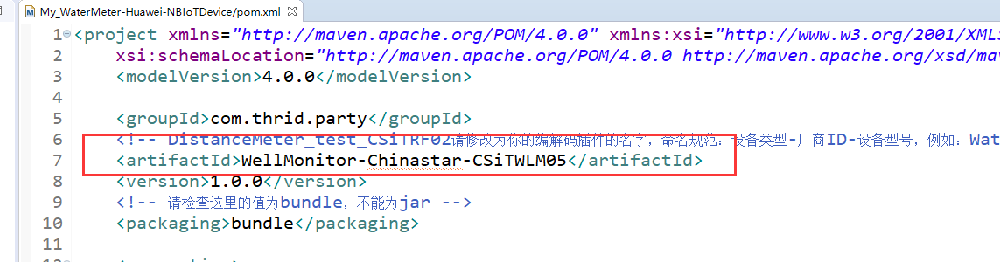

图3‑6 pom修改厂商名称

图3‑7 pom修改厂商名称

修改ProtocolAdapterImpl.java中的厂商名称与设备型号，注意与Profile保持一致。如图3‑8所示。

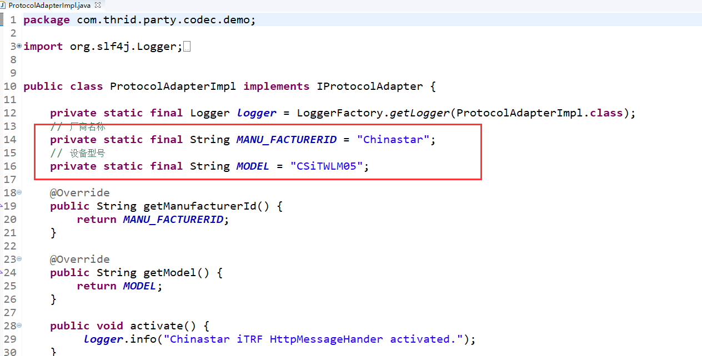

图3‑8 修改Protocol文件

### 编写下行编码

数据下行编码流程如图3‑9所示，通过获取OC平台发送过来的json数据，首先根据serviceId将对应数据保存到全局变量中，然后调用toByte方法，将各种类型的数据装换为16进制的比特数组。拼装成一条完整的报文并返回。其中mid为消息序号，根据通信协议中是否使用消息序号来决定代码中是否使用。详情请参照文末样例代码。

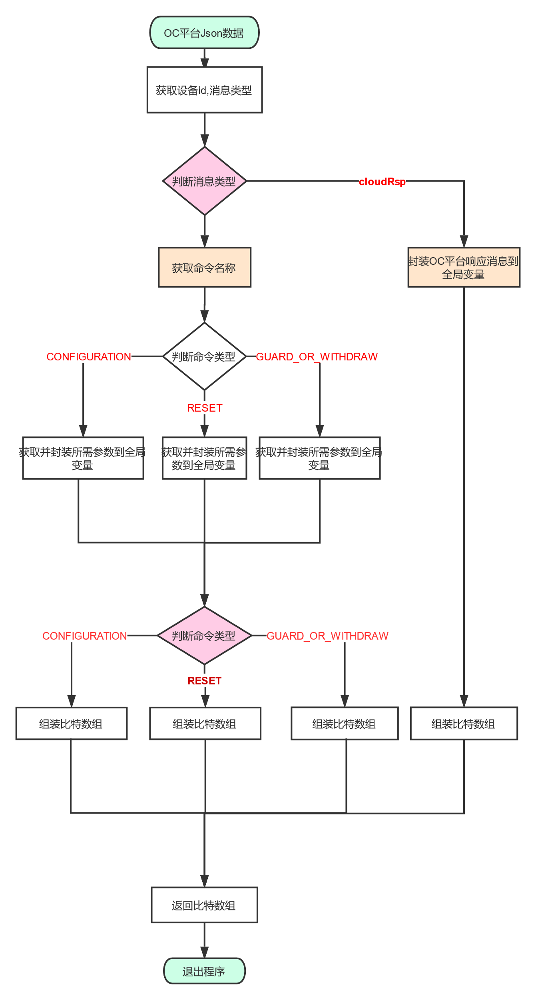

图3‑9 数据下行编码流程图

### 编写上行解码

数据上行解码流程如图3‑10所示。通过获取OC平台发送过来的16进制比特数组格式数据，首先根据比特数组中的功能码（功能码在数据哪个位置，请从通信协议中查看），将不同服务对应的不同数据，根据通信协议将byte类型的属性转换为所需类型，保存到全局变量中，然后调用toJsonNode方法，拼装成一个Json对象并返回。其中mid为消息序号，根据通信协议中是否使用消息序号来决定代码中是否使用。详情请参照文末样例代码。

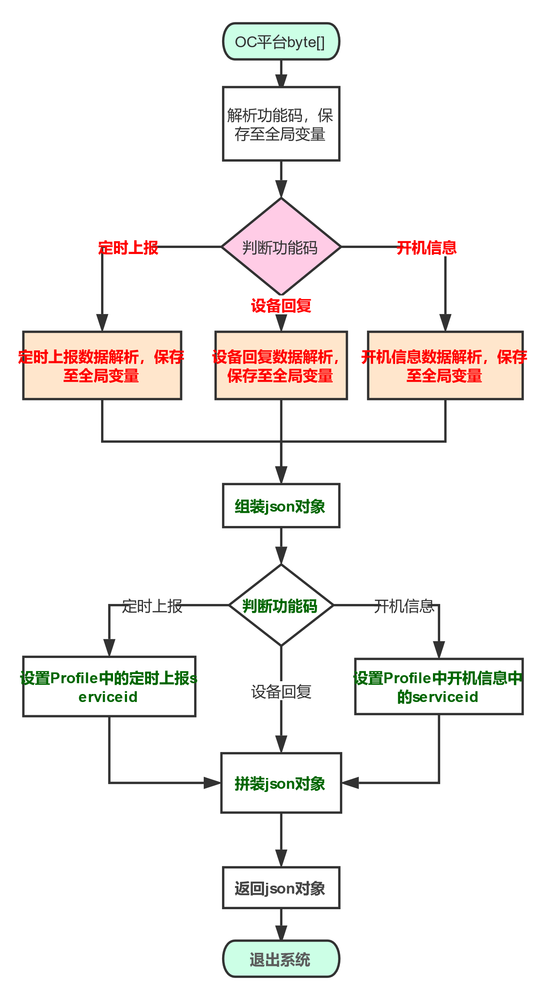

图3‑10 数据上行解码流程图

打包编解码
----------

打包编解码，即将该maven工程打包成jar文件。检查pom.xml中的\<packaging\>bundle\</packaging\>值是否为bundle，不能为jar。以eclipse为例，在工程上右键选择Run
As然后选择Maven build…如图3‑11所示。

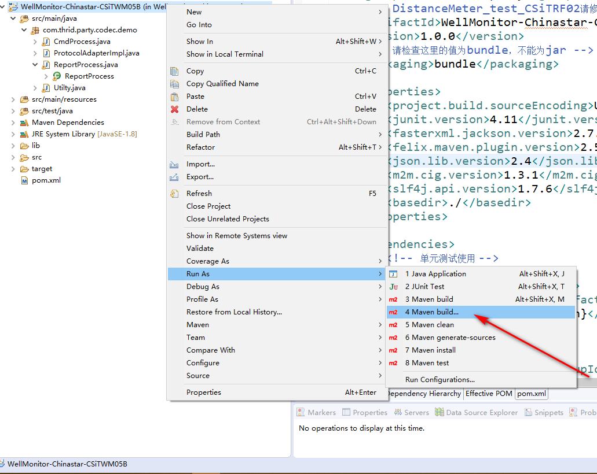

图3‑11 Mavenbuild

在Goals中输入clean package点击Run按钮，如图3‑12所示。

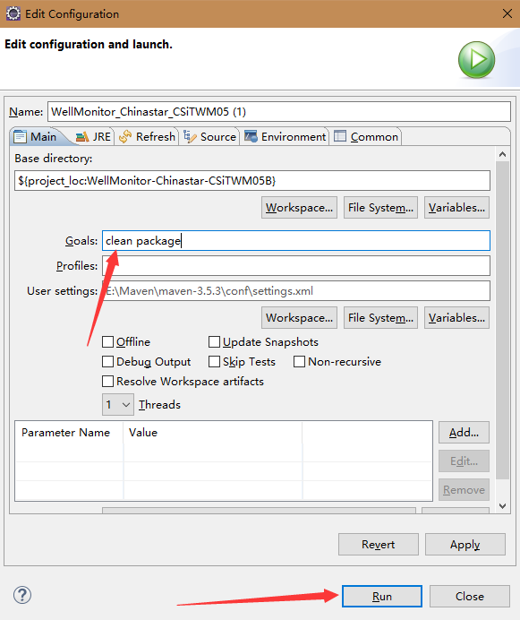

图3‑12 Mavenpackage

等待控制台出现BUILD
SUCCESS，即可在当前项目的target目录下找到打包好的jar文件，如图3‑13所示，打包编解码完成。

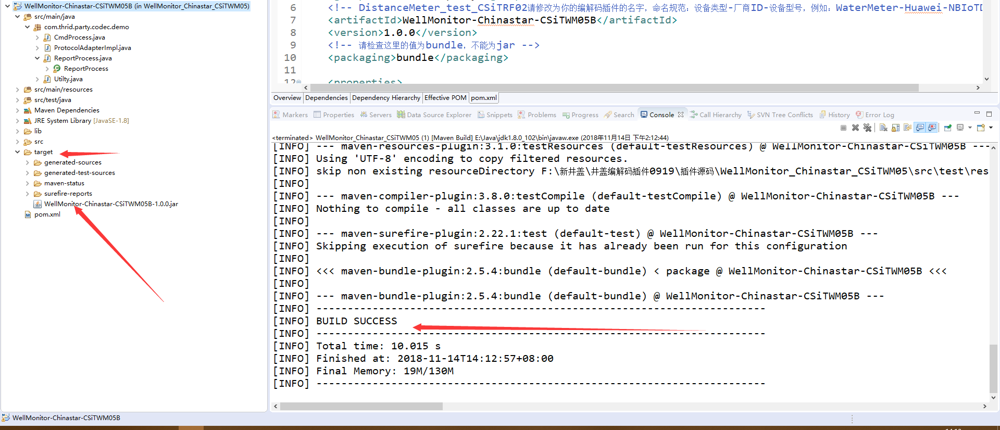

图3‑13 Build

附录

上行代码。

package com.thrid.party.codec.demo;

import java.util.Arrays;

import com.fasterxml.jackson.databind.ObjectMapper;

import com.fasterxml.jackson.databind.node.ArrayNode;

import com.fasterxml.jackson.databind.node.ObjectNode;

public class ReportProcess {

// private String identifier;

private String msgType = "deviceReq";

private int hasMore = 0;

private int errcode = 0;

// 在报文中表示报文类型的字段

private byte bFunctionCode;

// 开机信息功能码

private static final byte DEVICE_POWER_ON = 0x01;

// 数据上报功能码

private static final byte DEVICE_DATA_REPORT = 0x02;

// 应答报文功能码

private static final byte DEVICE_REPLY = (byte) 0xAA;

// 无后续数据

private static final int NO_MORE = 0;

private static final String REQUEST ="deviceReq";

private static final String RESPONSE ="deviceRsp";

private int identifier;

private int protocolVersion;

// 终端类型默认为12

private int deviceType;

private int iDeviceState = 0;

// 终端压力阈值（默认未0），上行数据会对这个值进行覆盖

private int distanceAlarmThreshold = 0;

;

// 终端定时上报时间 ，上行数据会对这个值进行覆盖

private int iHeartBeatTime = 0;

// 终端报警间隔时间，上行数据会对这个值进行覆盖

private int iAlarmReportInterval = 0;

private int iSampleInterval = 0;

// 终端硬件版本，上行数据会对这个值进行覆盖

private int iVersionHW = 1;

// 终端软件版本，，上行数据会对这个值进行覆盖

private int iVersionFW = 1;

// 终端SN号，上行数据会对这个值进行覆盖

private int iDeviceSN = 1;

private int iNbiotState = 0;

// 电池状态，上行数据会对这个值进行覆盖

private int iBatteryState = 0;

// 云端应答状态，上行数据会对这个值进行覆盖

private int iAckState = 0;

private int iGuardState = 0;

// 报警状态 （默认为0不报警），在定时上报中会对这个值进行覆盖

private int iAlarmState = 0;

// 当前压力，在定时上报中会对这个值进行覆盖

private int iCurPValue = 0;

// 当前角度，在定时上报中会对这个值进行覆盖

private int iBatteryVoltage = 3600;

private int iBatteryCap;

// 信号强度，在定时上报中会对这个值进行覆盖

private int iSignalStrength = 0;

// 信号覆盖等级，在定时上报中会对这个值进行覆盖

private int iSignalECL = 0;

// 信噪比，在定时上报中会对这个值进行覆盖

private int iSignalSNR = 0;

// 小区所在Id,在定时上报中会对这个值进行覆盖

private int iCellId = 0;

// 小区所在得PCI,在定时上报中会对这个值进行覆盖

private int iSignalPCI = 0;

// 温度，在定时上报中会对这个值进行覆盖

// private int iTemperature = 0;

// 终端回应设置信息时上发的错误码

private int iResult = 0;

private int mid = 0;

private int curTilt = 0;

private int bgTilt = 0;

private int gasDensity = 0;

private int alarmThreshold = 0;

private int waterStatus = 0;

private int deviceState = 0;

private String strDevPostfix;

private String imei;

private String imsi;

/\*\*

\* \@param binaryData 设备发送给平台coap报文

\* \@return

\*/

public ReportProcess(byte[] binaryData) {

binaryData = Utilty.getInstance().positionFormat(binaryData);

protocolVersion = binaryData[0];

bFunctionCode = binaryData[1];

identifier = Utilty.getInstance().bytes2Int(binaryData, 2, 2);

mid = Utilty.getInstance().bytes2Int(binaryData, 4, 2);

Utilty.getInstance().mid = mid;

Utilty.getInstance().functioncode = bFunctionCode;

System.out.println("dingmingdong\\n");

System.out.println(Utilty.getInstance().mid);

System.out.println(identifier);

if (bFunctionCode == DEVICE_POWER_ON) {

msgType = REQUEST;

hasMore = NO_MORE;

iDeviceSN = Utilty.getInstance().bytes2Int(binaryData,8, 4);

deviceType = binaryData[12];

// iGuardState = binaryData[5];

iVersionHW = binaryData[13];

iVersionFW = Utilty.getInstance().bytes2Int(binaryData,14, 4);

//strDevPostfix = new String(binaryData, 14, 16);

//iDeviceState = Utilty.getInstance().bytes2Int(binaryData,30, 2);

iHeartBeatTime = Utilty.getInstance().bytes2Int(binaryData, 20, 2);

iAlarmReportInterval = Utilty.getInstance().bytes2Int(binaryData, 22, 2);

iSampleInterval = Utilty.getInstance().bytes2Int(binaryData, 24, 2);

imei = new String(binaryData, 26, 16);

imsi = new String(binaryData, 42, 16);

alarmThreshold = Utilty.getInstance().bytes2Int(binaryData, 58, 2);

//
binArray用于存放状态码的二进制数字，由于binaryData[31]转换的二进制数组中目前未携带有用信息，不做解析

// int[] binArray = Utilty.getInstance().byte2Binary(binaryData[30]);

// iBatteryState = binArray[0];

//iAckState = binArray[1];

// iNbiotState = binArray[2];

// iGuardState = binArray[3];

// iAlarmState = binArray[4];

// iDeviceState = binArray[5];

// iBlueteethState = binArray[6];

// strModuleVersion = new String(binaryData, 21, 20);

} else if( bFunctionCode == DEVICE_DATA_REPORT ){

msgType = REQUEST;

hasMore = NO_MORE;

iDeviceSN = Utilty.getInstance().bytes2Int(binaryData,8, 4);

deviceState = Utilty.getInstance().bytes2Int(binaryData,12, 2);

// iBatteryVoltage = Utilty.getInstance().bytes2Int(binaryData, 4, 2);

iBatteryCap = Utilty.getInstance().bytes2Int(binaryData, 14, 1);

iSignalStrength = Utilty.getInstance().bytes2Int(binaryData, 16, 4);

iSignalECL = binaryData[20];

iSignalSNR = binaryData[21];

iCellId = Utilty.getInstance().bytes2Int(binaryData, 22, 4);

iSignalPCI = Utilty.getInstance().bytes2Int(binaryData, 26, 2);

bgTilt = Utilty.getInstance().bytes2Int(binaryData, 28, 2);

curTilt = Utilty.getInstance().bytes2Int(binaryData, 30, 2);

gasDensity = Utilty.getInstance().bytes2Int(binaryData, 32, 2);

waterStatus = Utilty.getInstance().bytes2Int(binaryData, 34, 2);

}else if (bFunctionCode == DEVICE_REPLY) {

msgType = RESPONSE;

// 在华为的API中规定 ： errcode 为0表示成功，1表示失败 ；但下位机协议中规定
错误码为
0无错误，1超范围，2检验错误；在profile文件中终端的应答应当包含一个int型的result参数,

// 为了避免数据损失，在这里
将终端的错误码放在result中，而errcode按照华为的API规定，只要下位机的错误码不为零，就认为失败，即在error中装入1.

errcode = binaryData[8]==0?0:1;

iResult = binaryData[8];

} else {

return;

}

}

public ObjectNode toJsonNode() {

try {

//组装body体

ObjectMapper mapper = new ObjectMapper();

ObjectNode root = mapper.createObjectNode();

String s = Integer.toString(this.identifier);

root.put("identifier", s);

System.out.println(s);

root.put("msgType", this.msgType);

//根据msgType字段组装消息体

if (this.msgType.equals(REQUEST) && bFunctionCode == DEVICE_POWER_ON) {

root.put("hasMore", this.hasMore);

ArrayNode arrynode = mapper.createArrayNode();

// serviceId = Basic 数据组装

ObjectNode BasicNode = mapper.createObjectNode();

BasicNode.put("serviceId", "Basic");

ObjectNode BasicData = mapper.createObjectNode();

BasicData.put("heartBeatTime", this.iHeartBeatTime);

BasicData.put("alarmReportInterval", this.iAlarmReportInterval);

BasicData.put("sampleInterval", this.iSampleInterval);

BasicData.put("mid", this.mid);

//hydrantBasicData.put("tiltAlarmThreshold", this.iTiltAlarmThreshold);

BasicNode.put("serviceData",BasicData);

arrynode.add(BasicNode);

// serviceId = Tilt 数据组装

ObjectNode TiltNode = mapper.createObjectNode();

TiltNode.put("serviceId", "Tilt");

ObjectNode TiltData = mapper.createObjectNode();

TiltData.put("alarmThreshold", this.alarmThreshold);

//hydrantBasicData.put("tiltAlarmThreshold", this.iTiltAlarmThreshold);

TiltNode.put("serviceData",TiltData);

arrynode.add(TiltNode);

// serviceId = DeviceInfo 数据组装

ObjectNode deviceInfoNode = mapper.createObjectNode();

deviceInfoNode.put("serviceId", "DeviceInfo");

ObjectNode deviceInfoData = mapper.createObjectNode();

deviceInfoData.put("deviceType", this.deviceType);

deviceInfoData.put("versionHW", this.iVersionHW);

deviceInfoData.put("versionFW", this.iVersionFW);

deviceInfoData.put("deviceSN", this.iDeviceSN);

deviceInfoData.put("imei", this.imei);

deviceInfoData.put("imsi", this.imsi);

deviceInfoData.put("deviceID", this.identifier);

deviceInfoData.put("protocolVersion", this.protocolVersion);

//deviceInfoData.put("moduleVersion", this.strModuleVersion);

deviceInfoNode.put("serviceData",deviceInfoData);

arrynode.add(deviceInfoNode);

root.put("data", arrynode);

} else if(this.msgType.equals(REQUEST) && bFunctionCode == DEVICE_DATA_REPORT){

root.put("hasMore", this.hasMore);

ArrayNode arrynode = mapper.createArrayNode();

// serviceId = Basic 数据组装

ObjectNode BasicNode = mapper.createObjectNode();

BasicNode.put("serviceId", "Basic");

ObjectNode BasicData = mapper.createObjectNode();

//BasicData.put("batteryVoltage", this.iBatteryVoltage);

BasicData.put("batteryLevel",this.iBatteryCap);

BasicData.put("deviceState", this.deviceState);

BasicData.put("mid", this.mid);

BasicNode.put("serviceData",BasicData);

arrynode.add(BasicNode);

// serviceId = Connectivity 数据组装

ObjectNode connectivityNode = mapper.createObjectNode();

ObjectNode connectivityData = mapper.createObjectNode();

connectivityData.put("signalStrength", this.iSignalStrength);

connectivityData.put("cellId", this.iCellId);

connectivityData.put("signalECL", this.iSignalECL);

connectivityData.put("signalPCI", this.iSignalPCI);

connectivityData.put("signalSNR", this.iSignalSNR);

connectivityNode.put("serviceId", "Connectivity");

connectivityNode.put("serviceData",connectivityData);

arrynode.add(connectivityNode);

// serviceId = Tilt 数据组装

ObjectNode tiltNode = mapper.createObjectNode();

ObjectNode tiltData = mapper.createObjectNode();

tiltData.put("curTilt", this.curTilt);

tiltData.put("bgTilt", this.bgTilt);

tiltData.put("gasDensity", this.gasDensity);

tiltData.put("waterStatus", this.waterStatus);

tiltNode.put("serviceId", "Tilt");

tiltNode.put("serviceData",tiltData);

arrynode.add(tiltNode);

// serviceId = DeviceInfo 数据组装

ObjectNode deviceInfoNode = mapper.createObjectNode();

deviceInfoNode.put("serviceId", "DeviceInfo");

ObjectNode deviceInfoData = mapper.createObjectNode();

// deviceInfoData.put("deviceType", this.deviceType);

// deviceInfoData.put("versionHW", this.iVersionHW);

// deviceInfoData.put("versionFW", this.iVersionFW);

deviceInfoData.put("deviceSN", this.iDeviceSN);

// deviceInfoData.put("imei", this.imei);

// deviceInfoData.put("imsi", this.imsi);

deviceInfoData.put("deviceID", this.identifier);

deviceInfoData.put("protocolVersion", this.protocolVersion);

//deviceInfoData.put("moduleVersion", this.strModuleVersion);

deviceInfoNode.put("serviceData",deviceInfoData);

arrynode.add(deviceInfoNode);

// serviceId = DeviceState 数据组装

// ObjectNode deviceStateNode = mapper.createObjectNode();

// ObjectNode deviceStateData = mapper.createObjectNode();

//deviceStateData.put("guardState", this.iGuardState);

//deviceStateData.put("alarmState", this.iAlarmState);

//deviceStateData.put("moduleState", this.iNbiotState);

//deviceStateData.put("batteryState", this.iBatteryState);

//deviceStateData.put("ackState", this.iAckState);

//deviceStateNode.put("serviceId", "DeviceState");

//deviceStateNode.put("serviceData",deviceStateData);

//arrynode.add(deviceStateNode);

// serviceId = Temperature 数据组装

// ObjectNode temperatureNode = mapper.createObjectNode();

// ObjectNode temperatureData = mapper.createObjectNode();

// temperatureData.put("temperature", this.iTemperature);

// temperatureNode.put("serviceId", "Temperature");

// temperatureNode.put("serviceData",temperatureData);

// arrynode.add(temperatureNode);

root.put("data", arrynode);

}

else {

root.put("mid", this.mid);

root.put("errcode", this.errcode);

//组装body体，只能为ObjectNode对象

ObjectNode body = mapper.createObjectNode();

body.put("result", iResult);

root.put("body", body);

}

return root;

} catch (Exception e) {

e.printStackTrace();

return null;

}

}

}

下行数据代码。

package com.thrid.party.codec.demo;

import java.util.Arrays;

import com.fasterxml.jackson.databind.JsonNode;

import com.fasterxml.jackson.databind.node.ObjectNode;

public class CmdProcess {

private String identifier = "0";

private int intIdentifier = 0;

private String msgType = "deviceReq";

private String serviceId = "Brightness";

private int hasMore = 0;

private static int mid = 0;

private int errcode = 0;

private JsonNode paras;

private String cmd = "REREAD";

// 云端回应

private static final byte B_CMD_RESPONSE = (byte) 0xAA;

// 配置信息

private static final byte B_TO_CONFIGURATION = 0x03;

// 复位命令

private static final byte B_TO_RESET = 0x04;

// 布防/撤防

private static final byte B_TO_GUARD_OR_WITHDRAW = 0x05;

// 忽略本次报警

private static final byte B_TO_IGNORE = 0x06;

// 重新读取开机信息

private static final byte B_TO_REREAD = 0x07;

private static final byte B_TO_FACTORYDEFAULT = 0x09;

private static final byte B_TO_SAMPLE_BGTILT_RSP = 10;

// 在报文中表示报文类型的字段

private byte bFunctionCode;

// 在报文中表示信息长度的字段

private byte dataLength;

// 将要配置的新ID

private int iNewId;

// 上报时间

private int iHeartBeatTime;

// 报警间隔

private int iAlarmReportInterval;

private int iSampleInterval;

private byte protocolVersion = 1;

// IP设置

private int iAddressIP;

// 端口号设置

private int iAddressPort;

// 压力报警阈值

private int distanceAlarmThreshold;

private int reportmid;

private int iPressureAlarmLowThreshold;

private int iPressureAlarmUpDiff;

private int iPressureAlarmLowDiff;

// 倾斜角报警阈值

// private int iTiltAlarmThreshold;

// 在命令为GUARD_OR_WITHDRAW时是要布防还是撤防： 1表示布防，0表示撤防

private byte bGuardOrWithdraw = 1;

// 用于存储平台自动应答时返回的request字段，该字段即设备的上行数据

byte[] deviceRequest;

public CmdProcess() {

}

public CmdProcess(ObjectNode input) {

try {

try {

this.identifier = input.get("identifier").asText();

} catch (Exception e) {

}

mid = mid + 1;

this.msgType = input.get("msgType").asText();

// this.mid = input.get("mid").asInt();//未使用mid
在此处不能放出来，否则会造成程序异常

if (msgType.equals("cloudRsp")) {

this.errcode = input.get("errcode").asInt();

deviceRequest = input.get("request").binaryValue();

byte[] identifierBytes = {deviceRequest[3],deviceRequest[2]};

intIdentifier = Utilty.getInstance().bytes2Int(identifierBytes, 0, 2);

byte[] midBytes = {deviceRequest[5],deviceRequest[4]};

reportmid = Utilty.getInstance().bytes2Int(midBytes, 0, 2);

bFunctionCode = B_CMD_RESPONSE;

dataLength = 0x01;

} else {

this.cmd = input.get("cmd").asText();

switch (this.cmd) {

case "CONFIGURATION":

bFunctionCode = B_TO_CONFIGURATION;

dataLength = 22;

this.paras = input.get("paras");

iNewId = this.paras.get("newId").asInt();

iHeartBeatTime = this.paras.get("heartBeatTime").asInt();

iAlarmReportInterval = this.paras.get("alarmReportInterval").asInt();

iSampleInterval = this.paras.get("sampleInterval").asInt();

iAddressIP = this.paras.get("addressIP").asInt();

iAddressPort = this.paras.get("addressPort").asInt();

distanceAlarmThreshold = this.paras.get("distanceAlarmThreshold").asInt();

//iPressureAlarmLowThreshold =
this.paras.get("pressureAlarmLowThreshold").asInt();

//iPressureAlarmUpDiff = this.paras.get("pressureAlarmUpDiff").asInt();

//iPressureAlarmLowDiff = this.paras.get("pressureAlarmLowDiff").asInt();

//iTiltAlarmThreshold = this.paras.get("tiltAlarmThreshold").asInt();

break;

case "RESET":

bFunctionCode = B_TO_RESET;

dataLength = 0x00;

break;

case "SAMPLE_BGTILT_RSP":

bFunctionCode = B_TO_SAMPLE_BGTILT_RSP;

dataLength = 0x00;

break;

case "GUARD_OR_WITHDRAW":

bFunctionCode = B_TO_GUARD_OR_WITHDRAW;

dataLength = 0x01;

this.paras = input.get("paras");

bGuardOrWithdraw = (byte) this.paras.get("guardOrWithdraw").asInt();

break;

case "IGNORE":

bFunctionCode = B_TO_IGNORE;

dataLength = 0x00;

break;

case "REREAD":

bFunctionCode = B_TO_REREAD;

dataLength = 0x00;

break;

case "FACTORYDEFAULT":

bFunctionCode = B_TO_FACTORYDEFAULT;

dataLength = 0x00;

break;

default:

break;

}

}

} catch (Exception e) {

e.printStackTrace();

}

}

public byte[] toByte() {

try {

if (this.msgType.equals("cloudReq")) {

byte[] bytesRead = null;

int idid = 0;

try {

idid = Integer.parseInt(this.identifier);

} catch (NumberFormatException e) {

e.printStackTrace();

}

switch (this.cmd) {

case "CONFIGURATION":{

//iNewId = this.paras.get("newId").asInt();

//iHeartBeatTime = this.paras.get("heartBeatTime").asInt();

//iAlarmReportInterval = this.paras.get("alarmReportInterval").asInt();

//iAddressIP = this.paras.get("addressIP").asInt();

//iAddressPort = this.paras.get("addressPort").asInt();

//iPressureAlarmThreshold = this.paras.get("pressureAlarmThreshold").asInt();

//iTiltAlarmThreshold = this.paras.get("tiltAlarmThreshold").asInt();

dataLength = 18;

bytesRead= new byte[28];

bytesRead[0] = (byte)protocolVersion;

bytesRead[1] = bFunctionCode;

//byte[] bytesId = Utilty.getInstance().str2Bytes(this.identifier);

bytesRead[2] = (byte) (idid & 0xFF);

bytesRead[3] = (byte) (idid \>\> 8);

byte[] bytesmid = Utilty.getInstance().int2Bytes(CmdProcess.mid, 2);

bytesRead[4] = bytesmid[1];

bytesRead[5] = bytesmid[0];

bytesRead[6] = dataLength;

bytesRead[7] = 0;

byte[] bytesNewId = Utilty.getInstance().int2Bytes(this.iNewId, 2);

bytesRead[8] = bytesNewId[1];

bytesRead[9] = bytesNewId[0];

byte[] bytesHeartBeatTime = Utilty.getInstance().int2Bytes(this.iHeartBeatTime,
2);

bytesRead[10] = bytesHeartBeatTime[1];

bytesRead[11] = bytesHeartBeatTime[0];

byte[] bytesAlarmReportInterval =
Utilty.getInstance().int2Bytes(this.iAlarmReportInterval, 2);

bytesRead[12] = bytesAlarmReportInterval[1];

bytesRead[13] = bytesAlarmReportInterval[0];

byte[] bytesSampleInterval =
Utilty.getInstance().int2Bytes(this.iSampleInterval, 2);

bytesRead[14] = bytesSampleInterval[1];

bytesRead[15] = bytesSampleInterval[0];

byte[] bytesAddressIP = Utilty.getInstance().int2Bytes(this.iAddressIP, 4);

bytesRead[16] = bytesAddressIP[3];

bytesRead[17] = bytesAddressIP[2];

bytesRead[18] = bytesAddressIP[1];

bytesRead[19] = bytesAddressIP[0];

byte[] bytesAddressPort = Utilty.getInstance().int2Bytes(this.iAddressPort, 2);

bytesRead[20] = bytesAddressPort[1];

bytesRead[21] = bytesAddressPort[0];

byte[] bytesAlarmThreshold =
Utilty.getInstance().int2Bytes(this.distanceAlarmThreshold, 2);

bytesRead[22] = bytesAlarmThreshold[1];

bytesRead[23] = bytesAlarmThreshold[0];

bytesRead[24] = 0;

bytesRead[25] = 0;

byte[] bytesNoCRC = Arrays.copyOf(bytesRead, bytesRead.length - 2);

byte[] bytesCRC = Utilty.getInstance().CRC16(bytesNoCRC);

bytesRead[26] = bytesCRC[1];

bytesRead[27] = bytesCRC[0];

break;

}

case "RESET":{

bFunctionCode = B_TO_RESET;

dataLength = 0x00;

bytesRead= new byte[10];

bytesRead[0] = (byte)protocolVersion;

bytesRead[1] = bFunctionCode;

byte[] bytesId = Utilty.getInstance().str2Bytes(this.identifier);

bytesRead[2] = (byte) (idid & 0xFF);

bytesRead[3] = (byte) (idid \>\> 8);

byte[] bytesmid = Utilty.getInstance().int2Bytes(CmdProcess.mid, 2);

bytesRead[4] = bytesmid[1];

bytesRead[5] = bytesmid[0];

bytesRead[6] = dataLength;

bytesRead[7] = 0;

byte[] bytesNoCRC = Arrays.copyOf(bytesRead, bytesRead.length - 2);

byte[] bytesCRC = Utilty.getInstance().CRC16(bytesNoCRC);

bytesRead[8] = bytesCRC[1];

bytesRead[9] = bytesCRC[0];

break;

}

case "GUARD_OR_WITHDRAW":{

bFunctionCode = B_TO_GUARD_OR_WITHDRAW;

bGuardOrWithdraw = (byte) this.paras.get("guardOrWithdraw").asInt();

dataLength = 0x02;

bytesRead= new byte[12];

bytesRead[0] = (byte)protocolVersion;

bytesRead[1] = bFunctionCode;

byte[] bytesId = Utilty.getInstance().str2Bytes(this.identifier);

bytesRead[2] = (byte) (idid & 0xFF);

bytesRead[3] = (byte) (idid \>\> 8);

byte[] bytesmid = Utilty.getInstance().int2Bytes(CmdProcess.mid, 2);

bytesRead[4] = bytesmid[1];

bytesRead[5] = bytesmid[0];

bytesRead[6] = dataLength;

bytesRead[7] = 0;

bytesRead[8] = bGuardOrWithdraw;

bytesRead[9] = 0;

byte[] bytesNoCRC = Arrays.copyOf(bytesRead, bytesRead.length - 2);

byte[] bytesCRC = Utilty.getInstance().CRC16(bytesNoCRC);

bytesRead[10] = bytesCRC[1];

bytesRead[11] = bytesCRC[0];

break;

}

case "IGNORE":{

bFunctionCode = B_TO_IGNORE;

dataLength = 0x00;

bytesRead= new byte[10];

bytesRead[0] = (byte)protocolVersion;

bytesRead[1] = bFunctionCode;

byte[] bytesId = Utilty.getInstance().str2Bytes(this.identifier);

bytesRead[2] = (byte) (idid & 0xFF);

bytesRead[3] = (byte) (idid \>\> 8);

byte[] bytesmid = Utilty.getInstance().int2Bytes(CmdProcess.mid, 2);

bytesRead[4] = bytesmid[1];

bytesRead[5] = bytesmid[0];

bytesRead[6] = dataLength;

bytesRead[7] = 0;

byte[] bytesNoCRC = Arrays.copyOf(bytesRead, bytesRead.length - 2);

byte[] bytesCRC = Utilty.getInstance().CRC16(bytesNoCRC);

bytesRead[8] = bytesCRC[1];

bytesRead[9] = bytesCRC[0];

break;

}

case "SAMPLE_BGTILT_RSP":{

bFunctionCode = B_TO_SAMPLE_BGTILT_RSP;

dataLength = 0x00;

bytesRead= new byte[10];

bytesRead[0] = (byte)protocolVersion;

bytesRead[1] = bFunctionCode;

byte[] bytesId = Utilty.getInstance().str2Bytes(this.identifier);

bytesRead[2] = (byte) (idid & 0xFF);

bytesRead[3] = (byte) (idid \>\> 8);

byte[] bytesmid = Utilty.getInstance().int2Bytes(CmdProcess.mid, 2);

bytesRead[4] = bytesmid[1];

bytesRead[5] = bytesmid[0];

bytesRead[6] = dataLength;

bytesRead[7] = 0;

byte[] bytesNoCRC = Arrays.copyOf(bytesRead, bytesRead.length - 2);

byte[] bytesCRC = Utilty.getInstance().CRC16(bytesNoCRC);

bytesRead[8] = bytesCRC[1];

bytesRead[9] = bytesCRC[0];

break;

}

case "FACTORYDEFAULT":{

bFunctionCode = B_TO_FACTORYDEFAULT;

dataLength = 0x00;

bytesRead= new byte[10];

bytesRead[0] = (byte)protocolVersion;

bytesRead[1] = bFunctionCode;

byte[] bytesId = Utilty.getInstance().str2Bytes(this.identifier);

bytesRead[2] = (byte) (idid & 0xFF);

bytesRead[3] = (byte) (idid \>\> 8);

byte[] bytesmid = Utilty.getInstance().int2Bytes(CmdProcess.mid, 2);

bytesRead[4] = bytesmid[1];

bytesRead[5] = bytesmid[0];

bytesRead[6] = dataLength;

bytesRead[7] = 0;

byte[] bytesNoCRC = Arrays.copyOf(bytesRead, bytesRead.length - 2);

byte[] bytesCRC = Utilty.getInstance().CRC16(bytesNoCRC);

bytesRead[8] = bytesCRC[1];

bytesRead[9] = bytesCRC[0];

break;

}

case "REREAD":{

bFunctionCode = B_TO_REREAD;

dataLength = 0x00;

bytesRead= new byte[10];

bytesRead[0] = (byte)protocolVersion;

bytesRead[1] = bFunctionCode;

byte[] bytesId = Utilty.getInstance().str2Bytes(this.identifier);

bytesRead[2] = (byte) (idid & 0xFF);

bytesRead[3] = (byte) (idid \>\> 8);

byte[] bytesmid = Utilty.getInstance().int2Bytes(CmdProcess.mid, 2);

bytesRead[4] = bytesmid[1];

bytesRead[5] = bytesmid[0];

bytesRead[6] = dataLength;

bytesRead[7] = 0;

byte[] bytesNoCRC = Arrays.copyOf(bytesRead, bytesRead.length - 2);

byte[] bytesCRC = Utilty.getInstance().CRC16(bytesNoCRC);

bytesRead[8] = bytesCRC[1];

bytesRead[9] = bytesCRC[0];

break;

}

default:

break;

}

return bytesRead;

} else if (this.msgType.equals("cloudRsp")) {

byte[] bytesRead = new byte[12];

/\*

\*
平台对上行数据的自动应答过程中，并不会每次都去调用带参的构造方法（猜测），所以数据的具体组装需要在toByte方法中进行以保证回复及下发的稳定性

\*/

bFunctionCode = B_CMD_RESPONSE;

dataLength = 2;

/\*

\*
在此对捕获的设备命令进行校验，如果无错误，将errcode置为0，若校验错误，将其置为2

\*/

boolean isValide = false;

if(deviceRequest != null){

isValide = Utilty.getInstance().isValid(deviceRequest);

}

bytesRead= new byte[12];

bytesRead[0] = (byte)protocolVersion;

bytesRead[1] = B_CMD_RESPONSE;

//byte[] bytesId = Utilty.getInstance().int2Bytes(this.intIdentifier, 2);;

bytesRead[2] = deviceRequest[2];

bytesRead[3] = deviceRequest[3];

//byte[] bytesmid = Utilty.getInstance().int2Bytes(this.reportmid, 2);

bytesRead[4] = deviceRequest[4];

bytesRead[5] = deviceRequest[5];

bytesRead[6] = dataLength;

bytesRead[7] = 0;

bytesRead[8] = 0;//(byte) (isValide?0:2);

bytesRead[9] = (byte)Utilty.getInstance().functioncode;

byte[] bytesNoCRC = Arrays.copyOf(bytesRead, bytesRead.length - 2);

byte[] bytesCRC = Utilty.getInstance().CRC16(bytesNoCRC);

bytesRead[10] = bytesCRC[1];

bytesRead[11] = bytesCRC[0];

return bytesRead;

}

return null;

} catch (Exception e) {

// TODO: handle exception

e.printStackTrace();

return null;

}

}

}
